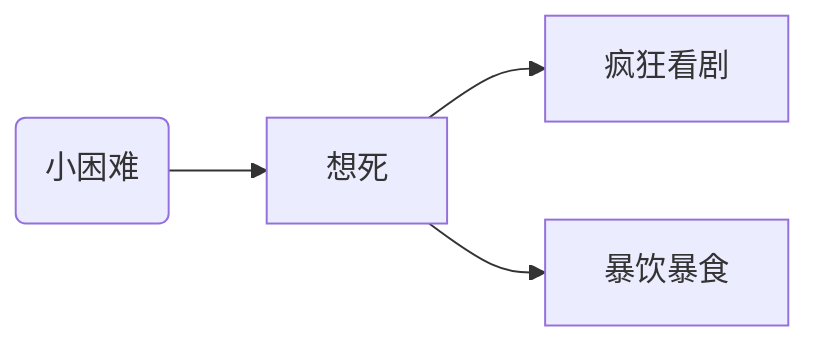

本文首次记录于2021/1/5，00:18~1:19

接着上篇没有认真准备而且错过了考研的推文，继续来聊。其实，我经常在想自己哪里做得不好，但只是想想而已，并没有去改正，更提不上进步了。

因此，我想用文字的方式来记录自己，以达到反思的目的。首先，我有太多太多的缺点，但几乎没有优点，不是谦虚，是真的没有什么优点。

下面谈谈缺点，从最致命到小痛小痒无关紧要这样来排序。

#### 1、想自杀

~~·哈哈哈，果然很致命。~~一旦我遇到了什么困难、小挫折，甚至说错了话，做了让自己或者别人尴尬的事情，我就会极度想死，仿佛死是唯一的出路，想解决出现问题的人本身(即我自己)，而不是解决问题。这种状况已经持续好多年了，大概是从我12岁开始吧，渐渐的这种想法就在我脑子里根深蒂固了。慢慢地，遇到挫折我心里想死，具体是通过看剧和暴饮暴食来逃避问题。

我目前还没有死，不然怎么能反思。我只尝试过一次自杀，不过由于我才11岁的弟弟一直陪着我，所以我并没有成功做到变成尸体。

这个其实有解决方案的。我最近看了一本非常短小精悍的时间管理类书，具体的时间管理方法，我没有学到什么，尽管里面有很多实操例子，~~但是我太懒了~~。

书中里面有一段话，另我印象非常深刻，对我三观重塑帮助很大。

> **你的大脑一次只能处理一个主导思想。**当你发现一个念头，比如一个消极的冲动偷偷溜进你的脑海里时，你要学会转移思想——将思想转变为强大的积极形象或想法。将注意力集中在积极想法上后，消极的想法会被取而代之，而你的大脑也会因此失去其消极的态度。

想自杀这是一种非常消极的想法，它经常会出现，很难受我的控制。但我作为大脑的主人，我可以控制它存在时间的长短。通过暴饮暴食和疯狂看剧来转移注意力，最终的结果就是它们存在的时间更长了。其实，**我完全可以通过积极的方式来对待这些消极的情绪和想法**，从而缩短它们存在的时间，一定程度上还可以降低它们出现的频率。

#### 2.难以适应环境

~~这个我都不想提，提起来真是令人想死。~~

之后再写吧。

#### 3.注意力难以集中，难以坚定目标

#### 4.容易自满

#### 5.盲目自信和极度自卑

看起来，似乎有点矛盾。但仔细一看，又是那么回事儿。当我发现我比周围的人做得好，就会开始膨胀，超级飘，就像走在云上面一样，觉得自己是天下第一，无敌聪明。反过来，比别人做得差的时候，就会一直想自己怎么这么笨，我这么笨为什么还有脑子，我的脑子一定是装饰品，里面一定装着屎。

这些导致的心态波动大，上一秒被表扬了，沾沾自喜，下一秒，被批评了，失魂落魄。对于一个成年人，没有稳定的情绪，对高效工作和学习是非常影响的。

这种情况，目前我还没有看到很好的解决方案，但相信一定也会有一本书给我答案的。

#### 6.喜欢攀比

